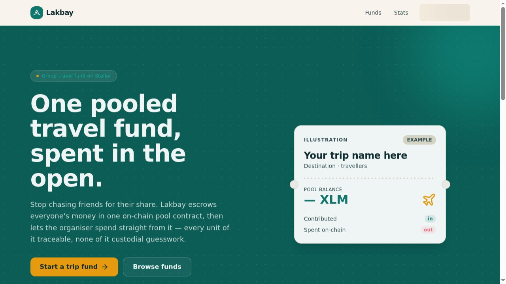
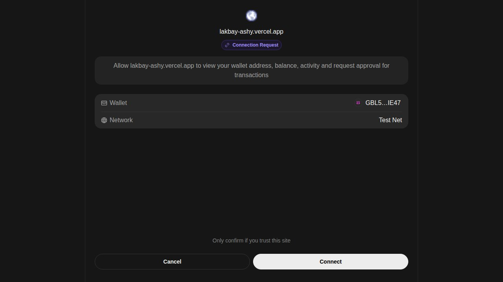
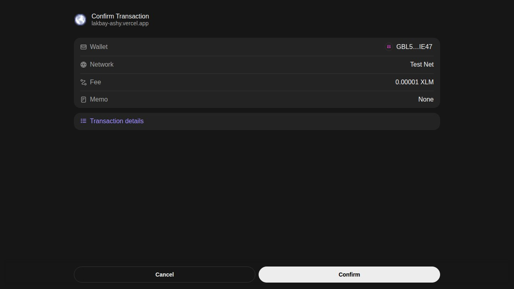
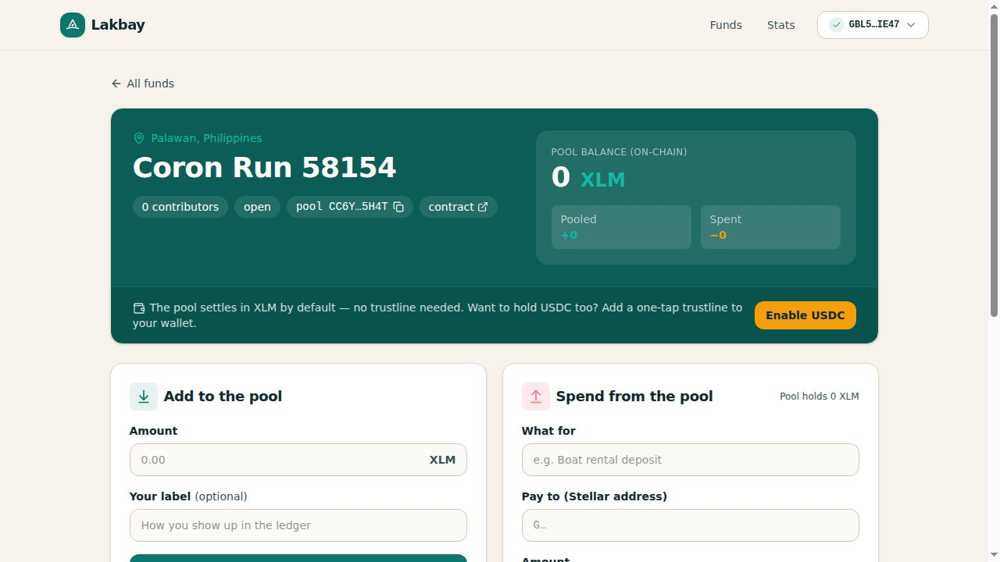
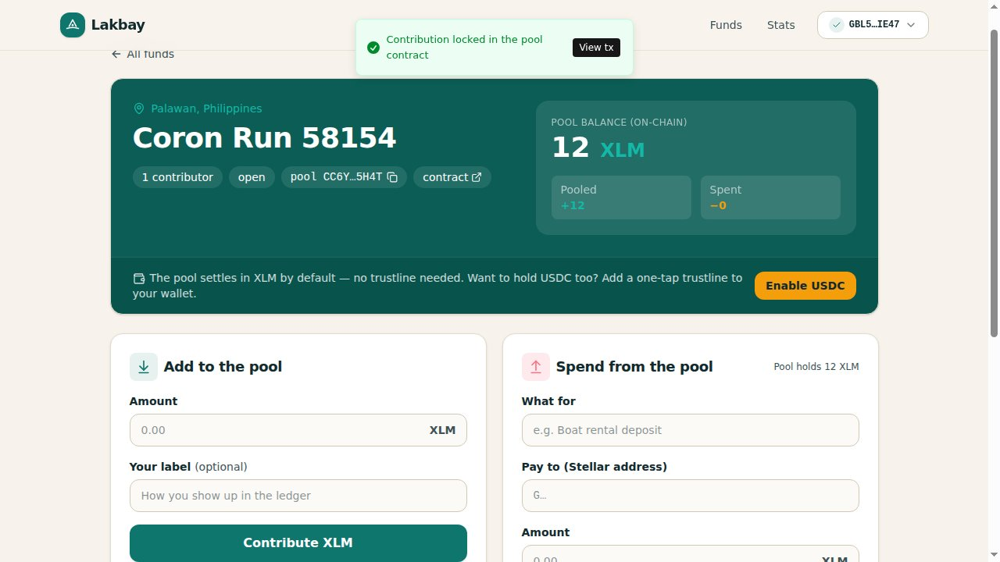
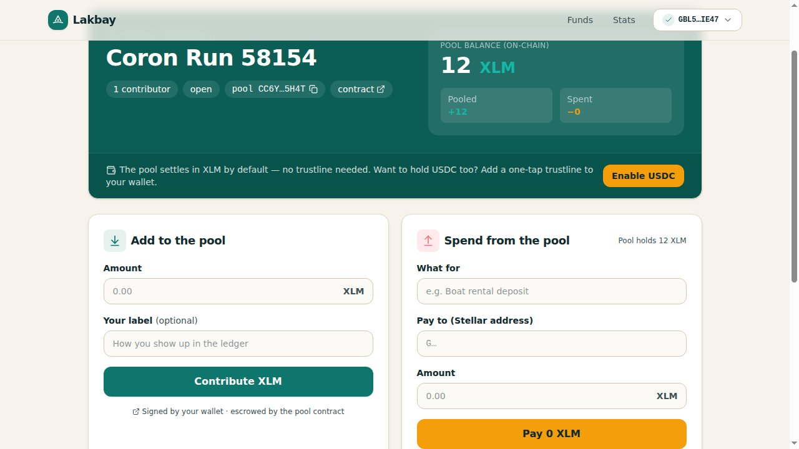
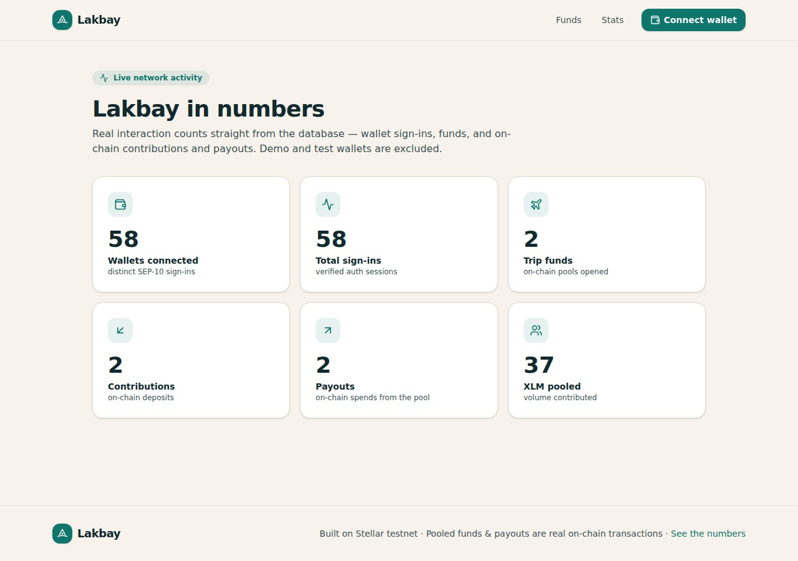
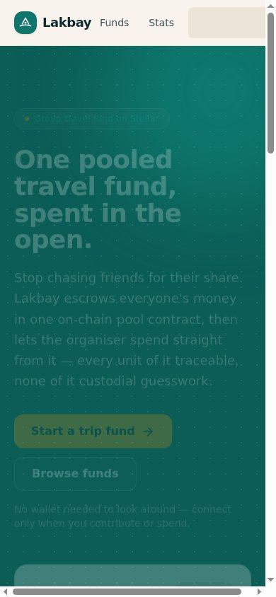

# Lakbay

**A group travel fund that escrows on Stellar — pool real money, spend it in the open.**

Live on testnet → **https://lakbay-ashy.vercel.app**

Lakbay (Filipino for *journey*) is a guided product tour below. Rather than describe it, walk it:
every stop is a real screenshot captured by Playwright against the live deployment, with a note on
exactly what hits the chain underneath. The crew pools XLM into a single Soroban pool contract, and
the organiser spends straight from it — every contribution and payout a signed contract invoke you
can open in a block explorer.

**Pool contract (testnet):** `CC6YMREXBYOITKX26BTDBGQ55AGRJ6RRGEBNMI3O4V6G2ZB45ZAB5H4T`
→ [view on stellar.expert](https://stellar.expert/explorer/testnet/contract/CC6YMREXBYOITKX26BTDBGQ55AGRJ6RRGEBNMI3O4V6G2ZB45ZAB5H4T)

---

## The tour

### 1 · Land



The front door. You can browse funds without a wallet — connecting is only required to *sign*.
Two destinations from here: open a new trip fund, or jump into an existing one. No spreadsheet, no
"one friend fronts everything and chases the rest."

### 2 · Connect



Tap connect and Freighter asks for access (`requestAccess`). Lakbay never sees a private key — the
browser extension holds it. This is the only place a wallet is needed: to put a signature on a
transaction.

### 3 · Prove the key (SEP-10)



The server hands the wallet a signed SEP-10 challenge transaction; the wallet counter-signs it
(this popup), and the server verifies the signature against your public key before issuing a session
cookie. Signing is **pinned to the app's network (testnet)** via `NEXT_PUBLIC_STELLAR_NETWORK`, so
connect works even if your wallet is parked on mainnet — no "wrong network" dead end.

### 4 · Open / view a fund



A fund is a **pool inside the `TravelFundPool` contract**, keyed by `sha256(trip id)`. Creating one
signs the `open_trip(organizer, trip_id, token)` invoke — that signature opens the on-chain pool and
makes you its organiser. The balance on this page is **read live from the contract** (`pooled` /
`balance` views), not a number stored in our database.

### 5 · Everyone chips in



Each traveller connects and contributes. The server builds + simulates the
`contribute(member, trip_id, amount)` invoke, Freighter signs it, and the server submits it via the
Soroban RPC and polls until it's applied. The contract pulls the XLM into its own custody and records
the member's lifetime contribution. Contributors appear in the ledger by their chosen label, or their
address if they didn't set one.

### 6 · Spend in the open



The organiser pays a vendor — boat, guesthouse, van — straight from the pool by signing
`spend(organizer, trip_id, payee, amount, memo)`. The contract releases the XLM and appends an
**immutable ledger entry** (payee, amount, memo hash, spend index). Only the organiser can spend, and
never more than the pool holds. Every in and out is one row with a `tx` link to stellar.expert.

### 7 · Honest numbers



`/stats` reads straight from the database: verified SEP-10 sign-ins, funds opened, and on-chain
contributions and payouts. Demo/test wallets are excluded so the counts mean something — no inflated
"users onboarded."

### 8 · Pocket-sized



The whole flow — connect, contribute, spend, ledger — works on a phone, because trips get planned and
paid for from one.

*Every screenshot above is a Playwright capture against the live deployment: real UI, real data.*

---
## Demo & Pitch Deck

- **Demo Video:** [Watch Demo](https://drive.google.com/file/d/1oN6dELyqEHvJRgKs7sp8MW9SSY90P98T/view?usp=drive_link)
- **Pitch Deck:** [View Pitch Deck](https://drive.google.com/file/d/1maz5s1sQx39fuYNNWpThiT8GUWlNoHVI/view?usp=drive_link)
---

## Real numbers

Live from the deployment: verified SEP-10 sign-ins, funds opened, and on-chain contributions and spends, all served by `GET /api/stats`. Demo and test wallets are excluded.


| Field | Value |
|---|---|
| Unique wallets | 58 |
| Logins | 58 |
| Trips opened | 2 |
| Contributions | 2 |
| Spends | 2 |
| Volume (XLM) | 37 |

## Two assets, no trust traps

- **XLM by default.** The pool settles in native XLM through its Stellar Asset Contract
  `CDLZFC3SYJYDZT7K67VZ75HPJVIEUVNIXF47ZG2FB2RMQQVU2HHGCYSC`, which needs **no trustline** — any
  funded wallet can contribute the moment it connects. Nobody gets stuck at `op_no_trust`.
- **USDC when you want it.** One tap on *Enable USDC* builds, signs, and submits a `changeTrust` to
  the testnet USDC issuer `GBBD47IF6LWK7P7MDEVSCWR7DPUWV3NY3DTQEVFL4NAT4AQH3ZLLFLA5` for your
  connected wallet, so you can hold USDC alongside your XLM.

## The contract

`TravelFundPool` — Rust + `soroban-sdk`, deployed to testnet on 2026-06-27. The server never holds a
key: it builds and simulates each invoke, the browser signs with Freighter, and the server submits via
the Soroban RPC with per-account sequence serialization and simulate-retry to ride out testnet RPC lag.

| Entrypoint | Signer | What it does |
|---|---|---|
| `open_trip(organizer, trip_id, token)` | organiser | Opens the on-chain pool for a trip |
| `contribute(member, trip_id, amount) -> i128` | member | Pulls XLM into the pool, records the member |
| `spend(organizer, trip_id, payee, amount, memo) -> u32` | organiser | Releases XLM, appends an immutable ledger entry |
| `refund(organizer, trip_id, member, amount, memo) -> u32` | organiser | Returns the remainder to a member at trip end |
| `close_trip(organizer, trip_id)` | organiser | Closes the trip |
| views | — | `get_trip, pooled, balance, member_amount, spend_count, get_spends, total_pooled, get_token, get_admin` |

Source, tests and the deployment record live in [`contracts/`](contracts/): `cargo +1.89.0 test` →
16 passing, optimized wasm 27,622 → 20,999 bytes, deployed with Stellar CLI v27. The mainnet switch
(network passphrase + `./scripts/deploy.sh public`) is documented in
[`contracts/DEPLOYMENT.md`](contracts/DEPLOYMENT.md) — **mainnet is not deployed; this is testnet only.**

## Tech stack

- **Next.js 16** (App Router, route handlers) + **React 19**
- **TypeScript**, **Tailwind CSS v4**, **next-themes**, **next-intl**
- **Drizzle ORM** on **Postgres** (Supabase)
- **Soroban** smart contract (Rust, `soroban-sdk`)
- **@stellar/stellar-sdk** + **@stellar/freighter-api v6**
- **jose** for the SEP-10 session cookie
- **Vitest** (unit) + **Playwright** (live e2e), **Biome** (lint/format)
- Deployed on **Vercel**

## Routes

| Route | What it is |
|---|---|
| `/` | Landing |
| `/trips` | Browse funds + create a fund (sign `open_trip`) |
| `/trips/[id]` | A fund: live pool balance, contribute, spend, ledger |
| `/stats` | Real interaction counts |
| `/api/auth/{challenge,verify,me,logout}` | SEP-10 session |
| `/api/trips`, `/api/trips/[id]` | List/create (build open), fund detail |
| `/api/trips/[id]/open/confirm` | Submit the signed `open_trip` invoke |
| `/api/trips/[id]/contribute` + `/contribute/confirm` | Build then submit a `contribute` invoke |
| `/api/trips/[id]/spend` + `/spend/confirm` | Build then submit a `spend` invoke |
| `/api/trips/[id]/enable-usdc` + `/enable-usdc/confirm` | Build then submit the USDC `changeTrust` |
| `/api/stats`, `/api/health` | Public counts, health |

## Run it locally

```bash
pnpm install
cp .env.example .env.local      # set DRIZZLE_DATABASE_URL + a 32+ char SESSION_SECRET
pnpm db:push                    # create tables
pnpm dev                        # http://localhost:3002
```

Build the contract:

```bash
cd contracts
cargo +1.89.0 test              # 16 passing
make optimize                   # build + optimize the wasm
./scripts/deploy.sh testnet     # deploy + initialize (Stellar CLI v27)
```

Quality gates:

```bash
pnpm test                       # vitest unit tests
pnpm build                      # production build
pnpm lint                       # biome
# live e2e (real Freighter, real on-chain through the contract) against a deployment:
PLAYWRIGHT_BASE_URL=https://lakbay-ashy.vercel.app xvfb-run -a npx playwright test --project=desktop-chrome
```

## Environment

| Var | Purpose |
|---|---|
| `DRIZZLE_DATABASE_URL` | Postgres connection string |
| `SESSION_SECRET` | ≥32 chars, signs the SEP-10 session cookie |
| `NEXT_PUBLIC_STELLAR_NETWORK` | `testnet` — pins signing + explorer links |
| `STELLAR_HORIZON_URL` | Horizon endpoint |
| `STELLAR_NETWORK_PASSPHRASE` | `Test SDF Network ; September 2015` |
| `SOROBAN_RPC_URL` | Soroban RPC endpoint |
| `TRAVEL_FUND_CONTRACT_ID` / `NEXT_PUBLIC_TRAVEL_FUND_CONTRACT_ID` | The deployed pool contract |
| `XLM_SAC_CONTRACT_ID` | Native XLM Stellar Asset Contract (the pool's token) |
| `USDC_ASSET_ISSUER_TESTNET` | USDC issuer for the opt-in trustline |
| `NEXT_PUBLIC_APP_URL` | Public base URL |

> Testnet only. The pool holds testnet XLM — never send mainnet value.
